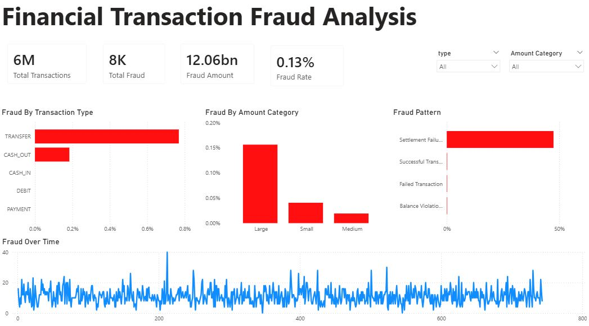

# Financial Transaction Fraud Analysis
## Objective

This project analyzes financial transaction data to identify fraud patterns and high risk behaviors. The goal is to support financial institutions in detecting and preventing fraudulent activities through data driven insights.

## Tools & Technologies
- Power BI
- DAX (Data Analysis Expressions)
- Data Modeling
- Data Visualization
  
## Dataset Overview

The dataset contains simulated financial transactions with features such as:

- Transaction type (TRANSFER, CASH_OUT, etc.)
- Transaction amount
- Account balances (origin & destination)
- Fraud indicators (isFraud, isFlaggedFraud)
  
## Data Preparation

- Cleaned and transformed raw transaction data using Power Query
- Created calculated columns:
  - Amount Category (Small, Medium, Large)
  - Transaction Status Classification
- Developed DAX measures:
  - Total Transactions
  - Total Fraud Cases
  - Fraud Rate (%)
  - Total Fraud Amount

## Key Metrics (KPIs)
- Total Transactions: 6M
- Total Fraud Cases: 8K
- Fraud Rate: 0.13%
- Total Fraud Amount: 12B+

## Dashboard Insights

### 1. Fraud by Transaction Type

Fraud is highly concentrated in TRANSFER and CASH_OUT transactions, indicating these as the primary risk channels.

### 2. Fraud by Transaction Amount

Large-value transactions exhibit the highest fraud rates, suggesting that fraudsters target high-value movements to maximize gains.

### 3. Fraud Pattern Analysis

Fraud is strongly associated with transaction inconsistencies, particularly settlement failures, indicating potential system vulnerabilities or account manipulation.

### 4. Fraud Trend Over Time

Fraud occurrences fluctuate over time with periodic spikes, highlighting the need for continuous monitoring systems.

## Dashboard Preview

## Key Findings
- Fraud is driven by a combination of:
  - Transaction type
  - Transaction size
  - System inconsistencies
- High-value transfers represent the highest risk scenario
- Fraud often involves abnormal balance behavior and failed transaction patterns

## Project Structure
- screenshots/ → Dashboard image

---

### N:B Dataset not included due to size limits.
- data/ → Raw dataset
- dashboard/ → Power BI file (.pbix)

Download here: https://drive.google.com/drive/folders/13XuZ0dnCUPkgeE_hUXnjAYAUsbjGJDKr?usp=sharing

